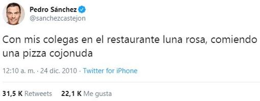

# Carta del restaurante Luna Rosa

## ( ͡❛ ͜ʖ ͡❛) Introducción

"Con mis colegas en el restaurante luna rosa, comiendo una pizza cojonuda" Tuiteado por nuestro ahora presidente, Pedro Sánchez, en la Nochebuena del año 2010.

Esto (y que era un proyecto que me mandaron en clase) fue lo que me inspiró a hacer una carta de un restaurante con Bootstrap.

**DISCLAIMER:** Esta carta y su contenido son ficticios. En ningún momento pretendo difamar al verdadero restaurante.

## ᕙ(`▿´)ᕗ Tecnologías utilizadas

Este proyecto únciamente ha utilizado Bootstrap.

## (ง︡'-'︠)ง Problemas encontrados en el desarrollo

No he encontrado ningún problema significativo.